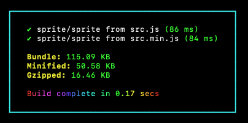

# Phaser 4 Dev

Rebooting the Phaser universe from scratch.


The code in this repo has been written specifically to test new features of Phaser 4 during development. Any code which we feel is useful to the wider community will eventually be moved to the official Phaser Examples repository. Consider this place as ground-zero, for tests only.

All examples are written in TypeScript and built via ESBuild.

To build an example:

`npm run dev --src filename`

If the filename, or folder, has a space in it, quote it:

`npm run dev --src "folder/longer filename"`



The bundle will be built into the `examples/live` folder, under the same folder given in the path.

The examples are accessible via GitHub Pages: https://phaserjs.github.io/dev/examples/live/

## Example using the npm package

You can import from the Phaser NPM package like this:

```js
import * as Easing from '@phaserjs/phaser/math/easing';

import { BackgroundColor, Parent, Scenes, WebGL } from '@phaserjs/phaser/config';

import { AddChildren } from '@phaserjs/phaser/display/';
import { AddTween } from '@phaserjs/phaser/motion/tween/nano/AddTween';
import { Game } from '@phaserjs/phaser/Game';
import { ImageFile } from '@phaserjs/phaser/loader/files/ImageFile';
import { Loader } from '@phaserjs/phaser/loader/Loader';
import { Scene } from '@phaserjs/phaser/scenes/Scene';
import { Sprite } from '@phaserjs/phaser/gameobjects/';
import { StaticWorld } from '@phaserjs/phaser/world/StaticWorld';

class Demo extends Scene
{
    constructor ()
    {
        super();

        const world = new StaticWorld(this);

        const loader = new Loader();

        loader.add(ImageFile('logo', 'assets/logo.png'));

        loader.start().then(() => {

            const logo = new Sprite(400, 100, 'logo').setRotation(0.3);

            AddTween(logo).to(3000, { y: 400, rotation: 0 }).easing(Easing.Bounce.Out);

            AddChildren(world, logo);

        });
    }
}

new Game(
    WebGL(),
    Parent('gameParent'),
    BackgroundColor(0x2d2d2d),
    Scenes(Demo)
);
```

## Example using the source code directly

You can directly import the Phaser TypeScript source into your bundle. Note that you must have the [Phaser repo](https://github.com/phaserjs/phaser) checked out locally and the paths must point to it. The following works fine on our test system, but you will need to adjust the paths for your own.

This method isn't meant for production. It's just meant to allow you to quickly test new Phaser features direct from the repo without a version having been published to npm, or without having to mess around with npm symlinking.

```js
import * as Easing from '../../../phaser-genesis/src/math/easing';

import { BackgroundColor, Parent, Scenes, WebGL } from '../../../phaser-genesis/src/config';

import { AddChildren } from '../../../phaser-genesis/src/display/';
import { AddTween } from '../../../phaser-genesis/src/motion/tween/nano/AddTween';
import { Game } from '../../../phaser-genesis/src/Game';
import { ImageFile } from '../../../phaser-genesis/src/loader/files/ImageFile';
import { Loader } from '../../../phaser-genesis/src/loader/Loader';
import { Scene } from '../../../phaser-genesis/src/scenes/Scene';
import { Sprite } from '../../../phaser-genesis/src/gameobjects/';
import { StaticWorld } from '../../../phaser-genesis/src/world/StaticWorld';

class Demo extends Scene
{
    constructor ()
    {
        super();

        const world = new StaticWorld(this);

        const loader = new Loader();

        loader.add(ImageFile('logo', 'assets/logo.png'));

        loader.start().then(() => {

            const logo = new Sprite(400, 100, 'logo').setRotation(0.3);

            AddTween(logo).to(3000, { y: 400, rotation: 0 }).easing(Easing.Bounce.Out);

            AddChildren(world, logo);

        });
    }
}

new Game(
    WebGL(),
    Parent('gameParent'),
    BackgroundColor(0x2d2d2d),
    Scenes(Demo)
);
```

## Example using the ESM Bundle

If you prefer, you can import Phaser entirely and modify your code like so:

We do not recommend this approach as it produces massive bundle sizes, no tree-shaking takes place.

```js
import * as Phaser from '@phaserjs/phaser';

import { BackgroundColor, Parent, Scenes, WebGL } from '@phaserjs/phaser/config';

import { AddTween } from '@phaserjs/phaser/motion/tween/nano/AddTween';

class Demo extends Phaser.Scene
{
    constructor ()
    {
        super();

        const world = new Phaser.World.StaticWorld(this);

        const loader = new Phaser.Loader.Loader();

        loader.add(Phaser.Loader.Files.ImageFile('logo', 'assets/logo.png'));

        loader.start().then(() => {

            const logo = new Phaser.GameObjects.Sprite(400, 100, 'logo').setRotation(0.3);

            AddTween(logo).to(3000, { y: 400, rotation: 0 }).easing(Phaser.Math.Easing.Bounce.Out);

            Phaser.Display.AddChildren(world, logo);

        });
    }
}

new Phaser.Game(
    WebGL(),
    Parent('gameParent'),
    BackgroundColor(0x2d2d2d),
    Scenes(Demo)
);
```
